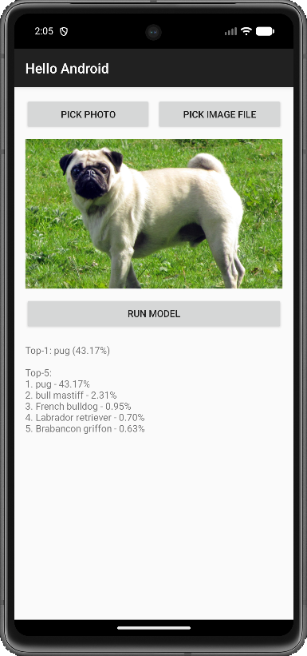

# Android + ExecuTorch MobileNetV2 (이미지 분류)

이 프로젝트는 **MobileNetV2 ExecuTorch 모델(`.pte`)을 Android(Java)에서 실행**해 사진 분류 결과를 보여줍니다.

## 현재 구현 상태

- 모델 로드 및 추론 실행
- 이미지 입력 지원 (사진 1장 선택)
- 입력 전처리: `224x224` 리사이즈, ImageNet Normalize, `NCHW` 변환
- 결과 후처리: Softmax 확률 계산
- 화면 출력: **Top-1 / Top-5 라벨 + 스코어(%)**
- 이미지 선택 경로 2개 제공
  - `Pick Photo`: Android Photo Picker (갤러리)
  - `Pick Image File`: 파일 앱(OpenDocument)

## 모델 입출력

- 입력 텐서: `1 x 3 x 224 x 224`
- 출력 텐서: `1000` 클래스 logits (ImageNet)

## 라벨 파일

- 앱에서 읽는 위치: `app/src/main/assets/labels.txt`
- 현재 `data/ImageNetLabels.txt`를 `assets/labels.txt`로 복사해 사용
- 라벨 파일이 `1001`줄이고 첫 줄이 `background`인 경우, 앱에서 자동으로 첫 줄을 제거해 `1000` 클래스와 인덱스를 맞춤

## 실행 방법

1. 앱 실행
2. 이미지 선택
   - 갤러리에서 선택: `Pick Photo`
   - 파일 앱에서 선택: `Pick Image File`
3. `Run Model` 클릭
4. 결과 확인

예시 출력:

```text
Top-1: tabby cat (83.41%)

Top-5:
1. tabby cat - 83.41%
2. tiger cat - 9.72%
3. Egyptian cat - 3.10%
4. lynx - 1.45%
5. Siamese cat - 0.88%
```

## 빌드

```bash
./gradlew :app:assembleDebug
```

## 주요 코드 위치

- `app/src/main/java/com/example/helloandroid/MainActivity.java`
  - Photo Picker / OpenDocument 연동
  - 이미지 디코딩 및 전처리
  - softmax + Top-K 계산 및 UI 출력
- `app/src/main/java/com/example/helloandroid/ModelRunner.java`
  - `model.pte` 로드 및 ExecuTorch 추론 실행
- `app/src/main/res/layout/activity_main.xml`
  - `Pick Photo`, `Pick Image File`, `Run Model`, 결과 텍스트 UI
- `app/src/main/assets/model.pte`
- `app/src/main/assets/labels.txt`

## 실행 결과 화면


